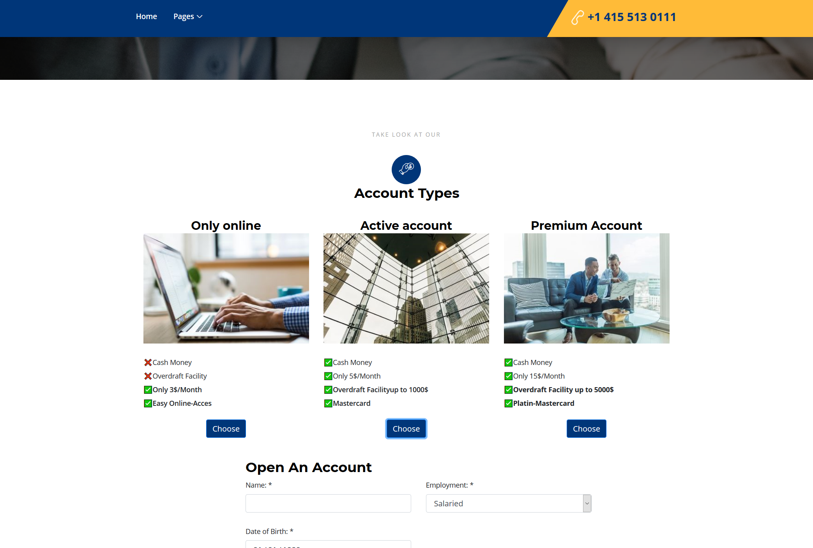
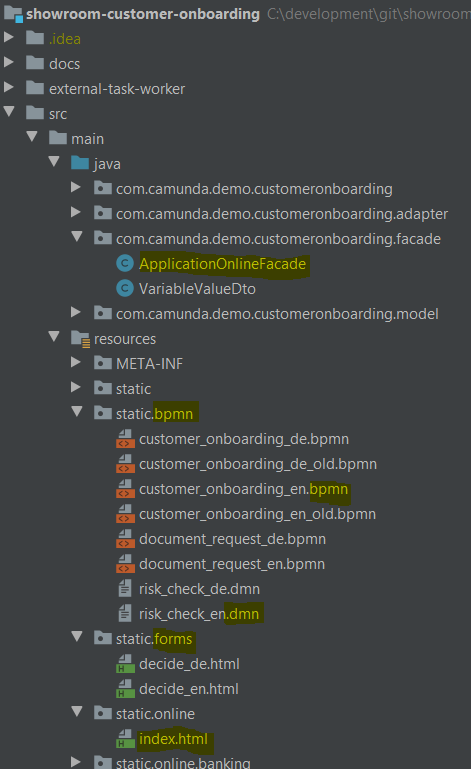

# Camunda showcase "Insurance Application" / "Versicherungsneuantrag"

# What it does
This demo showcases a simplified insurance or bank account application process using the Camunda platform for workflow and decision automation.

The project includes a simple self-contained, custom-made web frontend, which can be used to submit applications.
After deploymnet the web pages are available under:

* English: http://localhost:8080/camunda/online/index.html?lang=en
* German: http://localhost:8080/camunda/online/index.html?lang=de

On the landing page an insurance or banking frontend and the language can be selected.

Insurance application

Bank account application

The frontends start instances of the follwoing (BPMN) process via a simple REST API:

(src/main/resources/static/bpmn/customer_onboarding_en.bpmn)

The workflow first executes an automated decision (in DMN), determining if the application requires a manual assessment or can be process automatically:

(src/main/resources/static/bpmn/risk_check_en.dmn)

The camunda web applications will be accessible under http://localhost:8080/camunda

The user/password demo/demo can be used to login.
 

# Architecture
The showcase uses Spring Boot and the Camunda Spring boot starters. 
https://docs.camunda.org/manual/latest/user-guide/spring-boot-integration

Spring web is used for the REST services defined in *ApplicationOnlineFacade*

# How to build and run
1. clone project or download sources
2. build via Maven (*mvn clean package*)
3. run via Spring boot (*mvn spring-boot:run*) 

During startup the showcase **will generate test data**. This can take a few minutes.
You can already use the application during this time.
To start with a fresh database delete /camunda-db.mv.db and /camunda-db.trace.db.

Alternatively you can play online in the [Showroom](http://showroom.camunda.com/) without installing anything locally. The showroom is password protected and only accessible for camunda partners.

# Camunda Cloud Showcase

The 'camunda-cloud' branch of this repository contains a version of the showcase project that works with Camunda Cloud.

Note: You will need to download the zeebe-dmn-worker community extension and configure it with your Camunda Cloud credentials in order to get the DMN evaluation portion of your deployed process working. 

You can find the dmn worker repository and its setup instructions HERE. Once you have set up the zeebe-dmn-worker, you can follow the instructions below to get the showcase up and running.
# Instructions

1) If you do not have your own Camunda Cloud account and cluster, you will need to create both. Reference the [Camunda Cloud Getting Started Guide](https://camunda.com/blog/2019/09/getting-started-camunda-cloud/) for further instructions.

2) Once you have an account and have created a cluster, click on your cluster within Cloud Console. You should see an image similar to the one below. 

3) You now need to create API credentials so that your client code is able to connect to your cluster. Click on 'API' then the blue 'Create' button. Name your client, and ensure the checkboxes labelled 'Zeebe' and 'Tasklist' are both checked. Click 'Create' again and either download or note your credentials somewhere safe for later use.

4) Clone the 'camunda-cloud' branch of this repository to your local computer.

5) Find the 'application.yaml' file located in src/main/resources and update the clusterId, clientId, and clientSecret values to reflect your recently created API credentials. Do not commit these changes to a public repository unless you are comfortable with other users potentially accessing your Camunda Cloud cluster.

6)

During startup the showcase will automatically deploy the process model
including the form to the configured cluster. 
