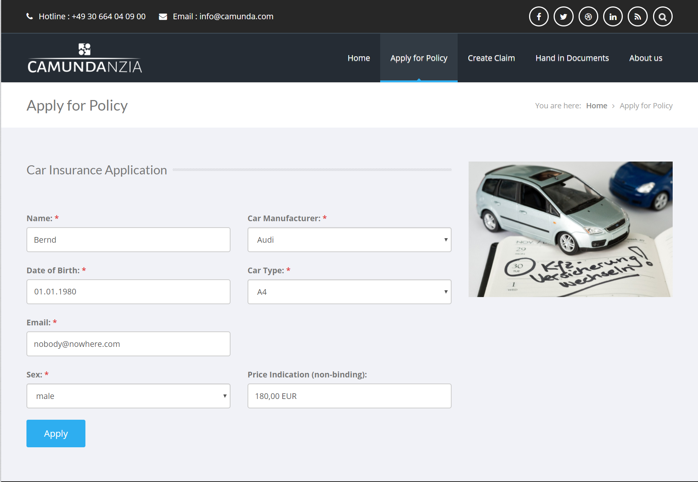
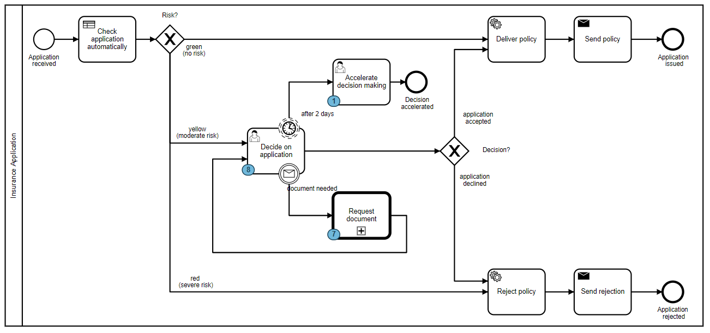
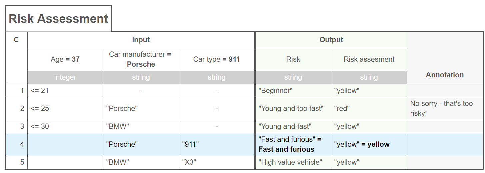
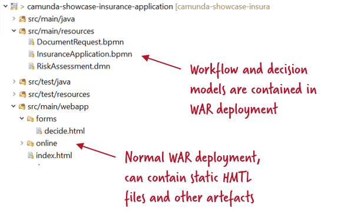

# Camunda showcase "Insurance Application" / "Versicherungsneuantrag"

# What it does

This demo showcases a simplified insurance application using the Camunda platform for workflow and decision automation. There is an English and a German version available.

To simulate customers there is a very simple self-contained, custom-made HTML page to hand in applications available after deployment:

* In English: http://localhost:8080/camunda-showcase-customer-onboarding/online/index.html?lang=en
* In German: http://localhost:8080/camunda-showcase-customer-onboarding/online/index.html?lang=de

This homepage calls a simple REST API, which kicks of a new workflow instance (in BPMN):

The workflow first executed an automated decision (in DMN) if the application needs manual assesment or can be applied or rejected completly manually:

# Architecture

The showcase uses the [container-managed engine](https://docs.camunda.org/manual/latest/introduction/architecture/#shared-container-managed-process-engine). It cannot run on Tomcat in this case but needs a Java EE container because of the [custom REST API developed using JAX-RS](src/main/java/com/camunda/demo/customeronboarding/facade/AntragOnlineFacade.java). We tested on WildFly. 

In order to deploy the workflow and decision model you can simply create a normal Java project creating a web application (WAR). Just include the workflow and decision models into that WAR and the container-managed engine will pick it up automatically.

# How to deploy and run this showcase

4. Download sources (or use git clone) and build yourself via Maven. Deploy it on the Java EE container of your choice, we tested on WildFly. Note that Tomcat will not be sufficient as we used JAX-RS. 

1. Play online in the [Showroom](http://showroom.camunda.com/) without installing anything yourself. The showroom is password protected and only accessible for Camunda partners.

2. Download WAR file to deploy on a standard Camunda distribution: [WildFly](https://app.camunda.com/nexus/content/groups/public/com/camunda/consulting/showcase/camunda-showcase-customer-onboarding/7.7.0-SNAPSHOT/)

