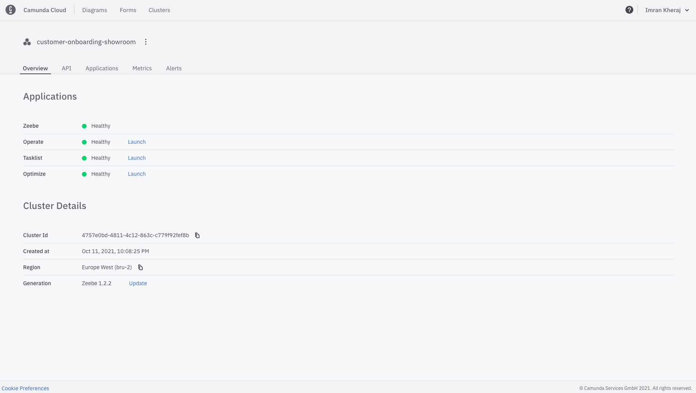

# Camunda showcase "Insurance Application" / "Versicherungsneuantrag"

# What it does
This demo showcases a simplified bank account application process using the Camunda Platform 8 for workflow and decision automation.

The project includes a simple self-contained, custom-made web frontend, which can be used to submit applications.
After deploymnet the web pages are available under:

* English: http://localhost:8080/camunda/online/index.html?lang=en
* German: http://localhost:8080/camunda/online/index.html?lang=de

# Versions (Iterations)

The most recent stable version is always accessible in the branch `camunda-8`.
Every iteration of the showcase is stored in a branch with naming scheme `c8-iterationX`, where `X` is the most recent iteration.
Note that this might point to a work-in-process state.
When an Iteration is final, you can find it as a [tag/release](https://github.com/camunda-consulting/showroom-customer-onboarding/releases) as well.
# Instructions

1. If you do not have your own Camunda 8 account and cluster, you will need to create both.

1. Once you have an account and have created a cluster, click on your cluster within Cloud Console. You should see something similar to the image below. 

1. You now need to create API credentials so that your client code is able to connect to your cluster. 
2. Click on 'API' then the blue 'Create' button. Name your client, and ensure the checkboxes labelled 'Zeebe' and 'Tasklist' are both checked. 
3. Click 'Create' again and download the Spring Boot credentials for the next steps.

1. You need to add the API-key for a sendgrid account to your cluster.
To do this, navigate to in Console yo your cluster and open 'Connector Secrets'.
Click the 'Create' button and name the key `SENDGRID_DEMO`, provide your sendgrid API key as 'Secret'.

1. Clone and start process application:
   
   1. Clone the 'camunda-8-iteration2-take-home' branch of this repository into a local folder `<process-app-dir>`.
   
   1. Move your application.properties into the project
   
   1. Start the application:

          mvn spring-boot:run -Dspring.config.location=application.properties -Dmaven.test.skip=true
      
      This will deploy the process to zeebe and start some job workers, also it published the UI.
      

1. Navigate to
   * [http://localhost:8080/camunda/online/banking/index.html?lang=en](http://localhost:8080/camunda/online/banking/index.html?lang=en) for Banking UI, or 
   * (not yet fully working) [http://localhost:8080/camunda/online/insurance/index.html?lang=en](http://localhost:8080/camunda/online/insurance/index.html?lang=en) for Insurance UI, or
   * (not yet fully working) [http://localhost:8080/camunda/online/telco/index.html?lang=en](http://localhost:8080/camunda/online/telco/index.html?lang=en) for Telco UI.
   
   Congratulations! Submit an application or two and check out your live processes by launching Operate from your Camunda 8 SaaS cluster.

